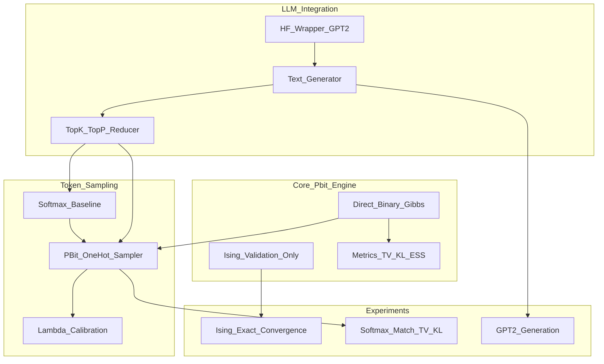

# P-bit QLLM Sampler - Implementation Plan V2 (Corrected)

## Overview

This plan implements a research-grade proof-of-concept for using p-bit networks (probabilistic bits) to sample tokens from LLM distributions. The key mathematical foundation is direct Gibbs sampling on binary variables y ∈ {0,1}^V with a one-hot penalty energy function.**Critical fixes applied:**

- Package renamed to `qllm_pbits/` (no collision risk)
- Direct binary Gibbs with correct conditional (no Ising mapping)
- Top-k/p via vocabulary reduction (no -inf in energy)
- Explicit resample fallback policy (3 attempts → argmax → log invalid-rate)
- Added requirements-lock.txt for pinned versions

## Architecture




## 1. Project Structure

Create package [`qllm_pbits/`](qllm_pbits/) with:

```javascript
qllm_pbits/
├── __init__.py              # Expose key APIs
├── pbits/
│   ├── __init__.py
│   ├── ising.py            # For validation experiments only
│   ├── gibbs_binary.py     # Direct {0,1} Gibbs sampler
│   └── metrics.py          # TV, KL, ESS, autocorrelation
├── token_sampler/
│   ├── __init__.py
│   ├── base.py             # Abstract TokenSampler interface
│   ├── softmax_baseline.py # Ground truth multinomial
│   ├── pbit_onehot.py      # Direct binary Gibbs with one-hot penalty
│   ├── calibration.py      # Lambda tuning tools
│   └── vocab_filter.py     # Top-k/top-p vocabulary reduction
├── llm/
│   ├── __init__.py
│   ├── hf_wrapper.py       # HuggingFace model interface
│   └── generate.py         # Text generation loop
├── experiments/
│   ├── __init__.py
│   ├── exp_ising_convergence.py
│   ├── exp_softmax_match.py
│   └── exp_text_generation.py
└── utils/
    ├── __init__.py
    ├── cli.py              # Unified CLI
    └── seeding.py          # Reproducibility

tests/
├── test_gibbs_binary.py
├── test_softmax_match_smallV.py
├── test_onehot_validity.py
├── test_vocab_filter.py
├── test_hf_integration.py  # @pytest.mark.slow
└── test_full_pipeline.py   # @pytest.mark.slow

notebooks/
├── 01_binary_gibbs_validation.ipynb
├── 02_softmax_vs_pbit_sampler.ipynb
└── 03_hf_gpt2_generation.ipynb

pyproject.toml
requirements-lock.txt        # Pinned versions (pip-tools/uv)
README.md
LICENSE (MIT)
.gitignore
```


### Config Files

**[`pyproject.toml`](pyproject.toml)** with dependency ranges:

```toml
[build-system]
requires = ["setuptools>=65.0", "wheel"]
build-backend = "setuptools.build_meta"

[project]
name = "qllm-pbits"
version = "0.1.0"
description = "P-bit networks for LLM token sampling"
authors = [{name = "Jules Barth", email = "julesbarth13@gmail.com"}]
requires-python = ">=3.11"
dependencies = [
    "torch>=2.0.0,<3.0.0",
    "transformers>=4.30.0,<5.0.0",
    "numpy>=1.24.0,<2.0.0",
    "scipy>=1.10.0,<2.0.0",
    "matplotlib>=3.7.0,<4.0.0",
    "tqdm>=4.65.0",
]

[project.optional-dependencies]
dev = [
    "pytest>=7.3.0",
    "pytest-cov>=4.1.0",
    "jupyter>=1.0.0",
]

[project.scripts]
qllm-pbits = "qllm_pbits.utils.cli:main"

[tool.pytest.ini_options]
markers = [
    "slow: marks tests as slow (deselect with '-m \"not slow\"')",
]
```

**[`requirements-lock.txt`](requirements-lock.txt)**: Pinned versions generated with pip-tools or uv:

```javascript
# Generate with: pip-compile pyproject.toml -o requirements-lock.txt
# or: uv pip compile pyproject.toml -o requirements-lock.txt
torch==2.1.0
transformers==4.35.2
numpy==1.26.2
scipy==1.11.4
matplotlib==3.8.2
tqdm==4.66.1
# ... (all transitive dependencies pinned)
```

Document in README: "Tested with versions in `requirements-lock.txt`"

## 2. Core P-bit Implementation

### [`qllm_pbits/pbits/gibbs_binary.py`](qllm_pbits/pbits/gibbs_binary.py)

**Direct Gibbs sampling on binary variables y ∈ {0,1}^V** (no spin mapping).Energy function:

```javascript
E(y) = -Σ_k z_k y_k + λ(Σ_k y_k - 1)²
```

where z_k are logits (or log-probs), λ is penalty strength.**Conditional probability derivation:**For bit i, let S = Σ_{k≠i} y_k. The energy difference for flipping y_i:

```javascript
ΔE = E(y_i=1) - E(y_i=0) 
   = [-z_i + λ(S+1-1)²] - [0 + λ(S-1)²]
   = -z_i + λ(S²) - λ(S² - 2S + 1)
   = -z_i + λ(2S - 1)
```

Therefore:

```javascript
P(y_i=1 | y_{-i}) = σ(-β ΔE) = σ(β(z_i - λ(2S - 1)))
```

where σ(x) = 1/(1 + e^(-x)) is the logistic sigmoid, β = 1/temperature.**Implementation:**

```python
class BinaryGibbsSampler:
    """Direct Gibbs sampler on {0,1}^V with one-hot penalty.
    
    Samples from π(y) ∝ exp(-β E(y)) where:
        E(y) = -Σ_k z_k y_k + λ(Σ_k y_k - 1)²
    
    Uses random-scan Gibbs: at each step, pick random i and update
    y_i ~ Bernoulli(σ(β(z_i - λ(2S-1)))) where S = Σ_{k≠i} y_k.
    """
    
    def __init__(self, beta: float = 1.0, device: str = "cpu"):
        """
        Args:
            beta: inverse temperature (1/T)
            device: torch device ("cpu", "cuda", "cuda:0")
        """
        self.beta = beta
        self.device = torch.device(device)
    
    def step(self, y: Tensor, z: Tensor, lam: float) -> Tensor:
        """Single random-scan Gibbs update.
        
        Args:
            y: binary state (V,) in {0,1}
            z: logits (V,)
            lam: penalty strength λ
        
        Returns:
            Updated y with one bit resampled
        """
        V = y.shape[0]
        
        # Pick random index
        i = torch.randint(0, V, (1,), device=self.device).item()
        
        # Compute S = Σ_{k≠i} y_k
        S_total = y.sum()
        S_minus_i = S_total - y[i]
        
        # Conditional probability P(y_i=1 | y_{-i})
        delta_E = -z[i] + lam * (2 * S_minus_i - 1)
        p_one = torch.sigmoid(self.beta * (-delta_E))
        
        # Sample new y_i
        y[i] = torch.bernoulli(p_one).item()
        return y
    
    def sample(self, z: Tensor, lam: float, n_steps: int, 
               burn_in: int = 0, initial_state: Tensor | None = None) -> Tensor:
        """Run Gibbs chain and return final state.
        
        Args:
            z: logits (V,)
            lam: penalty strength
            n_steps: number of sampling steps
            burn_in: number of steps to discard
            initial_state: starting state (default: random one-hot)
        
        Returns:
            Final binary state (V,)
        """
        V = z.shape[0]
        
        # Initialize
        if initial_state is not None:
            y = initial_state.clone().to(self.device)
        else:
            y = torch.zeros(V, device=self.device)
            y[torch.randint(0, V, (1,))] = 1  # Start with random one-hot
        
        # Burn-in + sampling
        for step in range(burn_in + n_steps):
            y = self.step(y, z, lam)
        
        return y
    
    def sample_chain(self, z: Tensor, lam: float, n_steps: int,
                     burn_in: int = 0) -> Tensor:
        """Return full trajectory for diagnostics.
        
        Returns:
            chain: (n_steps, V) binary states
        """
        V = z.shape[0]
        y = torch.zeros(V, device=self.device)
        y[torch.randint(0, V, (1,))] = 1
        
        # Burn-in
        for _ in range(burn_in):
            y = self.step(y, z, lam)
        
        # Collect chain
        chain = torch.zeros(n_steps, V, device=self.device)
        for t in range(n_steps):
            y = self.step(y, z, lam)
            chain[t] = y.clone()
        
        return chain
```


### [`qllm_pbits/pbits/ising.py`](qllm_pbits/pbits/ising.py)

**Keep for validation experiments only** (exact enumeration for small N).Implements standard Ising energy with spins m ∈ {-1,+1}^N:

```javascript
E(m) = -Σ_{ij} J_ij m_i m_j - Σ_i h_i m_i
```

Used only in exp_ising_convergence.py to validate Gibbs correctness on small systems (N≤12) via exact distribution computation.

### [`qllm_pbits/pbits/metrics.py`](qllm_pbits/pbits/metrics.py)

```python
def total_variation(p: Tensor, q: Tensor) -> float:
    """TV(p, q) = 0.5 * Σ |p_i - q_i|"""
    return 0.5 * torch.abs(p - q).sum().item()

def kl_divergence(p: Tensor, q: Tensor, eps: float = 1e-10) -> float:
    """KL(p||q) = Σ p_i log(p_i/q_i)"""
    p = p + eps
    q = q + eps
    return (p * torch.log(p / q)).sum().item()

def effective_sample_size(chain: Tensor, max_lag: int = 100) -> float:
    """ESS using autocorrelation."""
    # Implementation using scipy or manual computation
    pass

def invalid_onehot_rate(samples: Tensor) -> float:
    """Fraction of samples that are not valid one-hot vectors.
    
    Args:
        samples: (N, V) binary samples
    
    Returns:
        Fraction in [0, 1] of invalid samples
    """
    is_binary = ((samples == 0) | (samples == 1)).all(dim=1)
    sum_is_one = (samples.sum(dim=1) == 1)
    valid = is_binary & sum_is_one
    return 1 - valid.float().mean().item()
```


## 3. Token Sampling Layer

### [`qllm_pbits/token_sampler/base.py`](qllm_pbits/token_sampler/base.py)

```python
from abc import ABC, abstractmethod
from torch import Tensor

class TokenSampler(ABC):
    @abstractmethod
    def sample(self, logits: Tensor, temperature: float = 1.0,
               top_k: int | None = None, top_p: float | None = None,
               device: str = "cpu") -> int:
        """Sample a token index from logits.
        
        Args:
            logits: (V,) unnormalized log-probabilities
            temperature: scaling factor (higher = more random)
            top_k: keep only top-k tokens (None = no filtering)
            top_p: nucleus sampling threshold (None = no filtering)
            device: torch device
        
        Returns:
            token_id: integer in [0, V)
        """
        pass
```


### [`qllm_pbits/token_sampler/vocab_filter.py`](qllm_pbits/token_sampler/vocab_filter.py)

**Critical: Proper top-k/top-p via vocabulary reduction (NO -inf masking).**

```python
def apply_vocab_filter(logits: Tensor, top_k: int | None = None, 
                       top_p: float | None = None) -> tuple[Tensor, Tensor]:
    """Reduce vocabulary to filtered subset.
    
    Returns ONLY the logits and indices of kept tokens (no -inf).
    
    Args:
        logits: (V,) unnormalized logits
        top_k: keep top-k highest logits
        top_p: nucleus sampling (keep smallest set with cumsum prob > p)
    
    Returns:
        filtered_logits: (V',) logits for kept tokens
        keep_indices: (V',) original indices of kept tokens
    
    Example:
        logits = tensor([0.1, -2.0, 1.5, 0.3])  # V=4
        top_k = 2
        -> filtered_logits = tensor([1.5, 0.3])
        -> keep_indices = tensor([2, 3])
    """
    if top_k is not None:
        top_k = min(top_k, logits.shape[0])
        values, indices = torch.topk(logits, top_k)
        return values, indices
    
    if top_p is not None:
        sorted_logits, sorted_indices = torch.sort(logits, descending=True)
        probs = torch.softmax(sorted_logits, dim=0)
        cumsum = torch.cumsum(probs, dim=0)
        
        # Keep tokens until cumsum > top_p
        mask = cumsum <= top_p
        mask[0] = True  # Always keep at least one token
        
        return sorted_logits[mask], sorted_indices[mask]
    
    # No filtering: return all
    return logits, torch.arange(logits.shape[0], device=logits.device)
```


### [`qllm_pbits/token_sampler/softmax_baseline.py`](qllm_pbits/token_sampler/softmax_baseline.py)

```python
from .base import TokenSampler
from .vocab_filter import apply_vocab_filter

class SoftmaxMultinomialSampler(TokenSampler):
    """Ground truth baseline using torch.multinomial."""
    
    def sample(self, logits: Tensor, temperature: float = 1.0,
               top_k: int | None = None, top_p: float | None = None,
               device: str = "cpu") -> int:
        logits = logits.to(device)
        
        # Apply temperature
        scaled_logits = logits / temperature
        
        # Filter vocabulary (returns reduced set, not -inf masked)
        filtered_logits, keep_indices = apply_vocab_filter(
            scaled_logits, top_k, top_p
        )
        
        # Sample from filtered distribution
        probs = torch.softmax(filtered_logits, dim=0)
        local_idx = torch.multinomial(probs, 1).item()
        
        # Map back to original vocabulary
        return keep_indices[local_idx].item()
```


### [`qllm_pbits/token_sampler/pbit_onehot.py`](qllm_pbits/token_sampler/pbit_onehot.py)

**P-bit sampler with explicit resample fallback strategy.**

```python
from .base import TokenSampler
from .vocab_filter import apply_vocab_filter
from ..pbits.gibbs_binary import BinaryGibbsSampler

class PBitOneHotSampler(TokenSampler):
    """P-bit token sampler using direct binary Gibbs with one-hot penalty.
    
    Fallback strategy (as specified):
    1. Run Gibbs for n_gibbs_steps
    2. If result is not valid one-hot, resample (up to max_resample times)
    3. After max_resample failures, use argmax(y) as fallback
    4. Log invalid-rate for diagnostics
    """
    
    def __init__(self, lam: float = 10.0, n_gibbs_steps: int = 100,
                 beta: float = 1.0, max_resample: int = 3):
        """
        Args:
            lam: one-hot penalty strength λ
            n_gibbs_steps: Gibbs iterations per sample
            beta: inverse temperature (1/T)
            max_resample: max resample attempts before argmax fallback
        """
        self.lam = lam
        self.n_gibbs_steps = n_gibbs_steps
        self.beta = beta
        self.max_resample = max_resample
        self.invalid_count = 0
        self.total_count = 0
    
    def sample(self, logits: Tensor, temperature: float = 1.0,
               top_k: int | None = None, top_p: float | None = None,
               device: str = "cpu") -> int:
        logits = logits.to(device)
        
        # Apply temperature to logits
        scaled_logits = logits / temperature
        
        # Filter vocabulary (NO -inf, just reduction)
        filtered_logits, keep_indices = apply_vocab_filter(
            scaled_logits, top_k, top_p
        )
        
        # Gibbs sampling on reduced vocabulary V'
        sampler = BinaryGibbsSampler(beta=self.beta, device=device)
        
        # Resample strategy: try max_resample times
        for attempt in range(self.max_resample):
            y = sampler.sample(
                filtered_logits, 
                self.lam, 
                self.n_gibbs_steps, 
                burn_in=self.n_gibbs_steps // 2
            )
            
            # Check if valid one-hot
            is_binary = ((y == 0) | (y == 1)).all().item()
            sum_is_one = (y.sum().item() == 1)
            
            if is_binary and sum_is_one:
                # Valid one-hot: return token
                self.total_count += 1
                local_idx = y.argmax().item()
                return keep_indices[local_idx].item()
        
        # All resamples failed: use argmax fallback
        self.invalid_count += 1
        self.total_count += 1
        
        local_idx = filtered_logits.argmax().item()
        return keep_indices[local_idx].item()
    
    def get_invalid_rate(self) -> float:
        """Return fraction of samples that required fallback."""
        if self.total_count == 0:
            return 0.0
        return self.invalid_count / self.total_count
    
    def reset_stats(self):
        """Reset invalid-rate counters."""
        self.invalid_count = 0
        self.total_count = 0
```


### [`qllm_pbits/token_sampler/calibration.py`](qllm_pbits/token_sampler/calibration.py)

```python
def calibrate_lambda(logits: Tensor, lambda_range: list[float],
                     n_samples: int = 10000, target_tv: float = 0.01,
                     **sampler_kwargs) -> dict:
    """Grid search over λ to minimize TV distance to softmax.
    
    Returns:
        {
            'best_lambda': float,
            'best_tv': float,
            'results': DataFrame with (lambda, TV, KL, invalid_rate, time)
        }
    """
    pass

def convergence_analysis(logits: Tensor, lam: float, 
                        step_range: list[int]) -> dict:
    """Analyze TV/KL vs number of Gibbs steps."""
    pass
```


## 4. LLM Integration

### [`qllm_pbits/llm/hf_wrapper.py`](qllm_pbits/llm/hf_wrapper.py)

```python
class HFModel:
    def __init__(self, model_name: str = "distilgpt2", device: str = "cpu"):
        from transformers import AutoTokenizer, AutoModelForCausalLM
        
        self.tokenizer = AutoTokenizer.from_pretrained(model_name)
        self.model = AutoModelForCausalLM.from_pretrained(model_name)
        self.model.to(device)
        self.model.eval()
        self.device = device
    
    def get_logits(self, input_ids: Tensor, 
                   past_key_values=None) -> tuple[Tensor, Any]:
        """Forward pass returning next-token logits and KV cache."""
        with torch.no_grad():
            outputs = self.model(
                input_ids,
                past_key_values=past_key_values,
                use_cache=True
            )
        return outputs.logits[:, -1, :], outputs.past_key_values
```


### [`qllm_pbits/llm/generate.py`](qllm_pbits/llm/generate.py)

```python
def generate_text(model: HFModel, prompt: str, sampler: TokenSampler,
                  max_tokens: int = 50, temperature: float = 1.0,
                  top_k: int | None = None, top_p: float | None = None,
                  device: str = "cpu") -> dict:
    """Autoregressive text generation.
    
    Returns:
        {
            'text': str,
            'tokens': list[int],
            'time_per_token': float,
            'total_time': float,
            'invalid_rate': float (if sampler has get_invalid_rate)
        }
    """
    input_ids = model.tokenizer.encode(prompt, return_tensors="pt").to(device)
    past_kv = None
    
    generated_ids = []
    times = []
    
    # Reset sampler stats if available
    if hasattr(sampler, 'reset_stats'):
        sampler.reset_stats()
    
    for _ in range(max_tokens):
        start = time.time()
        
        logits, past_kv = model.get_logits(input_ids, past_kv)
        token_id = sampler.sample(
            logits[0], temperature, top_k, top_p, device
        )
        
        times.append(time.time() - start)
        generated_ids.append(token_id)
        
        input_ids = torch.tensor([[token_id]], device=device)
        
        if token_id == model.tokenizer.eos_token_id:
            break
    
    text = model.tokenizer.decode(generated_ids)
    result = {
        'text': text,
        'tokens': generated_ids,
        'time_per_token': np.mean(times),
        'total_time': sum(times)
    }
    
    # Add invalid rate if available
    if hasattr(sampler, 'get_invalid_rate'):
        result['invalid_rate'] = sampler.get_invalid_rate()
    
    return result
```


## 5. Experiments with Strict Validation Targets

### [`qllm_pbits/experiments/exp_ising_convergence.py`](qllm_pbits/experiments/exp_ising_convergence.py)

**Validation: Ising model exact convergence** (N=8, 12).

- Use [`ising.py`](qllm_pbits/pbits/ising.py) to compute exact π
- Run standard {-1,+1} Gibbs for 100k steps
- **Pass criteria:**
- TV < 0.01 after burn-in
- KL < 0.05 nats
- ESS > 500

### [`qllm_pbits/experiments/exp_softmax_match.py`](qllm_pbits/experiments/exp_softmax_match.py)

**Core validation: P-bit sampler matches softmax** (V=16, 32, 64).For each V:

1. Generate random logits
2. Baseline: sample 10k tokens with softmax
3. P-bit: sample 10k tokens with λ ∈ [5, 10, 20, 50]
4. **Strict pass criteria per λ:**

- TV < 0.02
- KL < 0.05 nats
- Invalid rate < 0.01 (99% valid one-hot, measured via `get_invalid_rate()`)
- Time/sample < 50ms on CPU

Output:

- Table showing (λ, TV, KL, invalid_rate, time/sample)
- Convergence plots (TV/KL vs steps)
- Recommended λ per V

### [`qllm_pbits/experiments/exp_text_generation.py`](qllm_pbits/experiments/exp_text_generation.py)

**GPT-2 generation experiment** (distilgpt2).

- 5 test prompts (diverse: story, technical, conversational)
- Generate 50 tokens each
- Compare:
- Baseline (T=1.0, top-k=50)
- P-bit (T=1.0, top-k=50, λ=recommended from exp2)
- **Metrics:**
- Time per token (target: <100ms CPU, <20ms GPU)
- Invalid sample rate via `get_invalid_rate()` (target: <1%)
- Qualitative text quality (human inspection)

Output:

- Side-by-side text comparison table
- Time/token statistics
- Invalid rate logged for each run

## 6. Testing Strategy

### Unit Tests (pytest)

**[`tests/test_gibbs_binary.py`](tests/test_gibbs_binary.py)**

- Verify conditional probability formula numerically
- Test convergence on small V=4 system with known distribution

**[`tests/test_vocab_filter.py`](tests/test_vocab_filter.py)**

- Top-k: verify correct k indices selected
- Top-p: verify cumulative probability threshold
- Verify NO -inf values in returned logits

**[`tests/test_softmax_match_smallV.py`](tests/test_softmax_match_smallV.py)**

- V=8, verify TV < 0.05 with λ=20, 1000 steps

**[`tests/test_onehot_validity.py`](tests/test_onehot_validity.py)**

- Generate 100 samples with λ=50
- Verify `get_invalid_rate()` < 0.05

**[`tests/test_hf_integration.py`](tests/test_hf_integration.py) **(**@pytest.mark.slow**)

- Load distilgpt2 or tiny-gpt2
- Verify logits shape and forward pass
- Run only with `RUN_SLOW=1 pytest`

**[`tests/test_full_pipeline.py`](tests/test_full_pipeline.py) **(**@pytest.mark.slow**)

- End-to-end: generate 10 tokens, verify output format
- Verify invalid_rate is logged

Run fast tests: `pytest -m "not slow"`Run all tests: `RUN_SLOW=1 pytest`

## 7. CLI Implementation

### [`qllm_pbits/utils/cli.py`](qllm_pbits/utils/cli.py)

```bash
# Run experiments
qllm-pbits experiment --type softmax --vocab-size 32 --device cpu --seed 42
qllm-pbits experiment --type generation --model distilgpt2 --device cuda:0

# Calibrate λ
qllm-pbits calibrate --vocab-size 64 --target-tv 0.01 --seed 42

# Generate text
qllm-pbits generate \
  --prompt "The future of AI" \
  --sampler pbit \
  --max-tokens 50 \
  --temperature 1.0 \
  --top-k 50 \
  --lambda 20 \
  --device cpu \
  --seed 42
```

Entry point in [`pyproject.toml`](pyproject.toml):

```toml
[project.scripts]
qllm-pbits = "qllm_pbits.utils.cli:main"
```


### [`qllm_pbits/utils/seeding.py`](qllm_pbits/utils/seeding.py)

```python
def set_seed(seed: int, deterministic: bool = False):
    """Set seeds for reproducibility.
    
    Args:
        seed: random seed
        deterministic: if True, enable torch.use_deterministic_algorithms
                       (may fail on some CUDA ops)
    """
    import random
    import numpy as np
    import torch
    
    random.seed(seed)
    np.random.seed(seed)
    torch.manual_seed(seed)
    torch.cuda.manual_seed_all(seed)
    
    if deterministic:
        torch.use_deterministic_algorithms(True)
        # Document: may cause issues with some CUDA operations
```


## 8. Notebooks

### [`notebooks/01_binary_gibbs_validation.ipynb`](notebooks/01_binary_gibbs_validation.ipynb)

- Visualize energy landscape for V=4
- Show Gibbs trajectory converging to one-hot states
- Plot invalid rate vs λ

### [`notebooks/02_softmax_vs_pbit_sampler.ipynb`](notebooks/02_softmax_vs_pbit_sampler.ipynb)

- Interactive λ tuning widget
- Real-time histogram comparison
- Plot TV/KL/invalid-rate vs steps

### [`notebooks/03_hf_gpt2_generation.ipynb`](notebooks/03_hf_gpt2_generation.ipynb)

- Load GPT-2, generate with both samplers
- Side-by-side text comparison table
- Display time/token and invalid-rate metrics

All notebooks start with:

```python
%load_ext autoreload
%autoreload 2
import sys; sys.path.insert(0, '..')
from qllm_pbits import *
```


## 9. Documentation

### [`README.md`](README.md)

Following your template:**Overview**: P-bit network simulator for sampling tokens from LLM distributions using direct Gibbs sampling on binary variables with one-hot penalty energy.**Tech Stack**: Python 3.11+, PyTorch 2.x, Transformers 4.x, pytest, matplotlib, scipy**Features**:

- Direct binary Gibbs sampler (y ∈ {0,1}^V) with mathematically correct conditionals
- Softmax-matching token sampler with one-hot constraint
- Explicit resample fallback strategy (3 attempts → argmax)
- GPT-2 integration for text generation
- Mathematical validation (TV, KL, ESS, invalid-rate tracking)
- Reproducible experiments with strict pass criteria

**How it works**:

1. Energy: E(y) = -Σ z_k y_k + λ(Σ y_k - 1)²
2. Direct Gibbs on {0,1}: P(y_i=1|y_{-i}) = σ(β(z_i - λ(2S-1)))
3. Top-k/p via vocabulary reduction (not -inf masking)
4. Resample strategy: 3 attempts, then argmax fallback, log invalid-rate

**Getting Started**:

```bash
# Install with locked versions
pip install -r requirements-lock.txt
pip install -e .

# Run tests
pytest -m "not slow"

# Run experiments
qllm-pbits experiment --type softmax --vocab-size 32
qllm-pbits generate --prompt "Hello world" --sampler pbit --lambda 20
```

**Tested versions**: See `requirements-lock.txt` for exact package versions validated on Windows 11.**What I learned**:

- Direct Gibbs correctness vs spin mappings
- Vocabulary filtering for stable energy-based sampling
- MCMC convergence diagnostics (TV, KL, ESS)
- Practical trade-offs: λ (constraint strength) vs mixing time vs invalid-rate

**Improvements**:

- Hardware p-bit simulation
- Annealing schedules (adaptive λ, temperature)
- Batch sampling (parallel chains)
- Larger models (Llama, GPT-J)
- Multi-token lookahead sampling

### Inline Documentation

- NumPy-style docstrings with LaTeX math for energy formulas
- Type hints throughout
- Detailed comments explaining conditional probability derivation

## 10. Strict Definition of Done

### Mathematical Correctness

- [ ] Binary Gibbs sampler passes unit test (V=4, known distribution)
- [ ] Conditional probability P(y_i=1|y_{-i}) verified analytically
- [ ] No Ising spin mapping in one-hot sampler

### Vocabulary Filtering

- [ ] Top-k/p returns reduced vocab (NO -inf in logits)
- [ ] Test verifies no -inf values in filtered_logits

### Softmax Matching (V=32)

- [ ] TV < 0.02 with optimal λ
- [ ] KL < 0.05 nats
- [ ] Invalid rate < 1% (via `get_invalid_rate()`)
- [ ] Time/sample < 50ms (CPU)

### Resample Fallback

- [ ] 3 resample attempts implemented
- [ ] Argmax fallback after failures
- [ ] `get_invalid_rate()` tracked and logged in all experiments

### GPT-2 Generation

- [ ] Generates coherent text (5/5 prompts pass human inspection)
- [ ] Invalid sample rate < 1%
- [ ] Time/token < 100ms (CPU) or < 20ms (GPU)
- [ ] Invalid-rate logged in output

### Reproducibility

- [ ] All experiments accept --seed
- [ ] Tests pass on Windows 11
- [ ] README includes `requirements-lock.txt` reference
- [ ] Deterministic mode behind --deterministic flag (documented caveats)

### Code Quality

- [ ] 80%+ test coverage
- [ ] All public functions have docstrings
- [ ] Type hints on all function signatures
- [ ] HF tests marked @pytest.mark.slow

## 11. Implementation Order

1. **Setup**: Project structure, pyproject.toml, requirements-lock.txt (pip-tools/uv)
2. **Core binary Gibbs**: [`gibbs_binary.py`](qllm_pbits/pbits/gibbs_binary.py) with correct conditional, unit tests
3. **Metrics**: [`metrics.py`](qllm_pbits/pbits/metrics.py) including `invalid_onehot_rate()`
4. **Vocab filter**: [`vocab_filter.py`](qllm_pbits/token_sampler/vocab_filter.py) (reduction, NO -inf), tests
5. **Baseline sampler**: [`softmax_baseline.py`](qllm_pbits/token_sampler/softmax_baseline.py)
6. **P-bit sampler**: [`pbit_onehot.py`](qllm_pbits/token_sampler/pbit_onehot.py) with resample+argmax, tests
7. **Softmax matching experiment**: Validate core approach with strict metrics
8. **HF integration**: [`hf_wrapper.py`](qllm_pbits/llm/hf_wrapper.py), [`generate.py`](qllm_pbits/llm/generate.py)
9. **Generation experiment**: GPT-2 text generation with invalid-rate logging
10. **Calibration tools**: [`calibration.py`](qllm_pbits/token_sampler/calibration.py)
11. **CLI**: [`cli.py`](qllm_pbits/utils/cli.py)
12. **Notebooks**: Interactive validation
13. **Documentation**: README with lock file reference, docstrings, final review

## 12. Key Limitations to Document

- **Not hardware**: Software PoC, no claims about physical p-bit speed/energy advantages
- **Mixing time**: Gibbs requires O(V) steps per sample (runtime trade-off vs multinomial O(1))
- **λ tuning**: Requires calibration per vocabulary size (higher V may need higher λ)